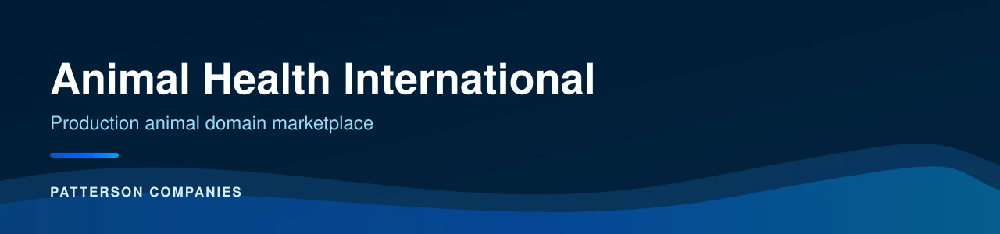
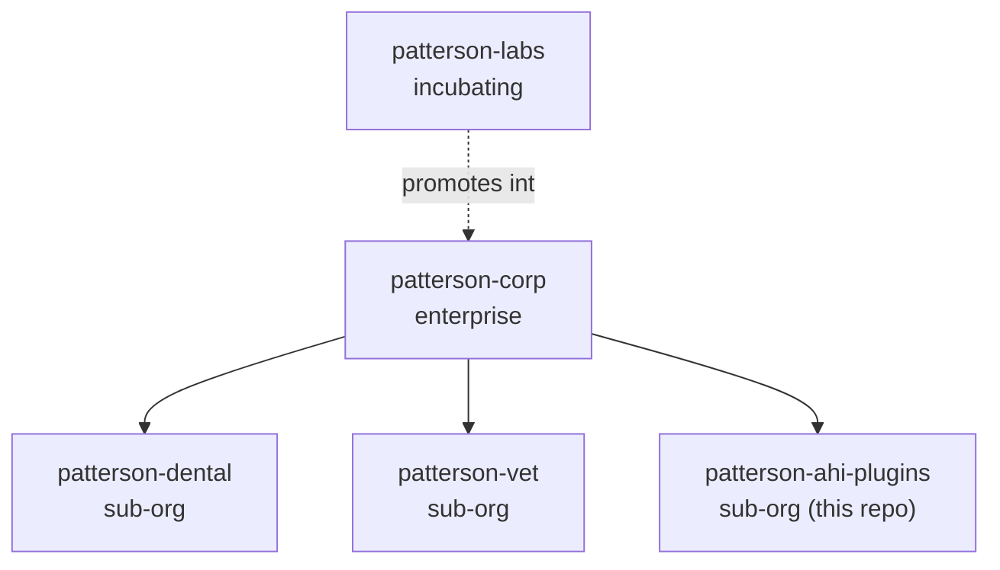

<div align="center">



# patterson-ahi-plugins

**Trusted Expertise. Unrivaled Support.** — the Animal Health International domain
marketplace: a sub-organization catalog for agent capability specific to Patterson's
production animal distribution business, with lot-level traceability analytics on
Microsoft Fabric.


</div>

---

## Table of contents

- [What this is](#what-this-is)
- [Where it fits](#where-it-fits)
- [Repository layout](#repository-layout)
- [Quick start](#quick-start)
- [Validation](#validation)
- [Contributing and references](#contributing-and-references)
- [Status](#status)

## What this is

`patterson-ahi-plugins` is the **sub-org** marketplace for capability that is particular to
Animal Health International — Patterson's production animal distribution business serving
cattle, dairy, swine, poultry, and equine operations — as opposed to `patterson-corp`,
which holds what is true across all of Patterson, or `patterson-labs`, which incubates work
that has not yet earned durable status anywhere.

It ships one plugin, `patterson-ahi`: the Animal Health International company profile,
domain agents for the production animal business, recall and territory-economics skills,
and a Microsoft Fabric skill for modeling lot-level traceability records.

## Where it fits



| Catalog | Role |
|---|---|
| `patterson-corp` | Enterprise — capability true for all of Patterson |
| `patterson-labs` | Incubating — work that has not yet earned durable status |
| `patterson-dental` | Sub-org — dental-specific capability |
| `patterson-vet` | Sub-org — veterinary-specific capability |
| **`patterson-ahi-plugins`** | **Sub-org — production-animal capability, Animal Health International (this repo)** |

> [!WARNING]
> Marketplace `name` values occupy one **flat global namespace**. Registering a second
> catalog under an existing name replaces the first rather than merging with it — each
> Patterson marketplace repository asserts a distinct name for this reason.

## Repository layout

```text
patterson-ahi-plugins/
├── .claude-plugin/
│   └── marketplace.json          # the catalog agents read
├── plugins/
│   └── patterson-ahi/            # Animal Health International domain plugin
│       ├── agents/               # production-animal business roles + data engineer
│       ├── skills/               # recall, territory economics, Fabric traceability
│       ├── references/           # brand voice + domain sources
│       └── COMPANY.md            # the company profile agents load
├── managed-settings.d/           # layered-settings placeholder (sub-org tier)
├── tests/
│   └── run-tests.sh              # zero-dependency validation suite
├── .devcontainer/
│   └── devcontainer.json         # node:24, pinned
└── .github/workflows/            # CI + Claude Code Actions
```

## Quick start

```bash
cd patterson-ahi-plugins
claude
/plugin marketplace add .
claude plugin install patterson-ahi@patterson-ahi-plugins
```

Enterprise standards and brand rules arrive by reference, not by copy: this repository's
`.claude/settings.json` enables `patterson-engineering@patterson-corp` and
`patterson-brand@patterson-corp` alongside the local catalog.

## Documentation site

A VitePress site under [`site/`](site/) documents the catalog, the plugin, and the
Microsoft Fabric traceability design, themed with the documented Patterson tokens:

```bash
cd site
bun install
bun run dev        # local preview
bun run build      # static build to site/docs/.vitepress/dist
```

The `site/` workspace is the repository's one pinned toolchain (VitePress 2 + Vue via
`bun.lock`); everything else remains zero-dependency.

## Validation

```bash
sh tests/run-tests.sh          # manifest validation, skill name-equals-directory, forbidden content
claude plugin validate .       # the canonical Claude Code plugin-marketplace check
```

<details>
<summary>What the test suite checks</summary>

- `.claude-plugin/marketplace.json` parses as JSON, its `name` is `patterson-ahi-plugins`,
  and the catalog is non-empty
- every plugin `source` begins with `./` and resolves to a real directory
- every `SKILL.md` frontmatter `name` equals its parent directory name
- no forbidden off-brand strings, no legacy Node 20-family image references, no `*.py`
  files, no font binaries, and no emoji on brand surfaces (`README.md`, `docs/**`,
  `marketplace.json`)

</details>

## Contributing and references

| File | Purpose |
|---|---|
| [`CONTRIBUTING.md`](CONTRIBUTING.md) | The canonical `patterson-corp` process plus how to propose a production-animal domain skill |
| [`REFERENCES.md`](REFERENCES.md) | Authoritative sources for production-animal domain content |

## Status

| Item | State |
|---|---|
| Plugins | 1 — `patterson-ahi` |
| License | Patterson Companies Internal Use License ([`LicenseRef-Patterson-Internal`](LICENSE)) |
| Remote repository | [`github.com/patterson-agents/patterson-ahi-plugins`](https://github.com/patterson-agents/patterson-ahi-plugins) |
