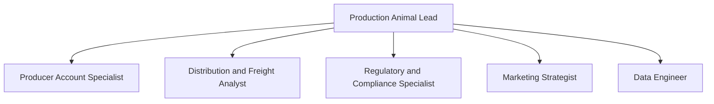

# Animal Health International

## Mission

Serve producers and the veterinarians who work with them across the production animal
market, where volume, freight, and seasonality drive the economics.

## Goals

- Hold share in a market where switching cost is low and price is visible
- Convert regional acquisitions into density rather than into overhead
- Keep freight and inventory economics ahead of the margin structure

## Context

Background that grounds the agents in this company. Anything an agent needs beyond
this belongs in an internal reference marked `[TBD]`.

- Patterson acquired Animal Health International in June 2015 for 1.1 billion dollars in cash, more than doubling the size of its animal health supply business and adding a leading production animal supply business.
- The production animal business acquired the operating assets of Mountain Vet Supply, a regional distributor headquartered in Fort Collins, Colorado, extending presence in the production and companion animal market.
- Production animal customers include producers, feed operations, and retailers as well as veterinarians.

## Org

Agent bodies live in `agents/` as harness-native subagent files. This section is the
org overlay: reporting lines, expressed once, rather than a second definition of the
same agents.

This plugin carries the production animal business roles plus a data engineer for the
Microsoft Fabric analytics platform. Deep engineering, design, and writing capability
arrives by reference through `patterson-engineering@patterson-corp` and
`patterson-brand@patterson-corp` rather than being duplicated here.

Reporting lines as a list

- `production-animal-lead` Production Animal Lead
  - `producer-account-specialist` Producer Account Specialist
  - `logistics-analyst` Distribution and Freight Analyst
  - `compliance-specialist` Regulatory and Compliance Specialist
  - `marketing-strategist` Marketing Strategist
  - `data-engineer` Data Engineer

## Engineering

| Aspect | Detail |
| --- | --- |
| Surfaces owned | producer ordering; route and delivery tooling; regulatory and traceability records |
| Stack | Microsoft Fabric is the data and analytics platform direction: OneLake for storage, Lakehouse (Delta) for lot-level traceability records, Power BI for producer and route reporting, with Fabric capacities governed under the `patterson-engineering` Azure standards. The application stack beyond the data platform is `[TBD] not established in this catalog`. |
| Data position | Lot-level traceability records, which carry regulatory retention obligations rather than privacy ones. |

## Audience and voice

| Aspect | Detail |
| --- | --- |
| Audiences | cattle and dairy producers; swine and poultry operations; equine operations; production animal veterinarians |
| Voice | Direct and operational. The reader runs a business with thin margins and no patience for abstraction. Technical accuracy over polish. This audience notices when a term is used loosely. |

Design, documentation, and marketing detail is in `references/brand.md`. Canonical
sources are in `references/sources.md`.

## Skills

| Skill | Use when |
| --- | --- |
| `model-territory-economics` | Use when evaluating whether to serve a new production animal territory, when a route is losing money, or when assessing whether a regional acquisition will pay for itself. |
| `handle-product-recall` | Use when a manufacturer issues a recall or withdrawal, when a product quality issue is reported from the field, or when someone asks which customers received a specific lot. |
| `lot-traceability-on-fabric` | Use when designing or querying lot-level traceability data on Microsoft Fabric, scoping a recall trace, or setting retention on traceability records. |
| `bootstrap-animal-health-intl` | Use when setting up, initializing, configuring, or onboarding the Animal Health International company plugin for real use, when filling in its [TBD] gaps, or when someone asks to capture this company's references, brand, coding standards, or team conventions. |

## Delegation

> [!IMPORTANT]
> Nesting is off by default in recent harness versions. Set
> `CLAUDE_CODE_MAX_SUBAGENT_SPAWN_DEPTH` above 1 for the reporting lines above to
> resolve as actual delegation rather than collapsing into a single agent doing
> everything itself.

> [!WARNING]
> A parent only ever receives the child's final report text, so a half-failed stage can
> summarize into optimism. Where a stage matters, have it write a machine-checkable
> artifact and have the parent read that instead.
