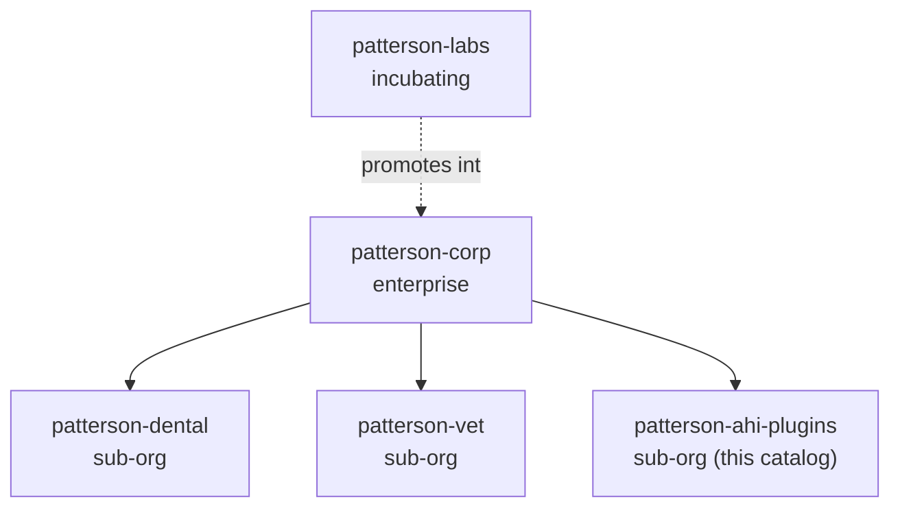

# Where this catalog fits

The Patterson agent platform is a family of plugin marketplaces, each asserting a distinct
name in one flat global namespace.

| Catalog | Role |
| --- | --- |
| `patterson-corp` | Enterprise - capability true for all of Patterson |
| `patterson-labs` | Incubating - work that has not yet earned durable status |
| `patterson-dental` | Sub-org - dental-specific capability |
| `patterson-vet` | Sub-org - veterinary-specific capability |
| `patterson-ahi-plugins` | Sub-org - production-animal capability, Animal Health International (this catalog) |

## The sub-org test

A capability belongs here only when it is genuinely production-animal-specific. If it would
also be true for dental or companion-animal veterinary, it belongs in `patterson-dental` or
`patterson-vet`; if it is true for all of Patterson, it belongs in `patterson-corp`.

## About Animal Health International

Patterson acquired Animal Health International in June 2015 for 1.1 billion dollars in
cash, more than doubling the size of its animal health supply business. The production
animal business serves producers, feed operations, and retailers as well as veterinarians,
in a market where volume, freight, and seasonality drive the economics.
